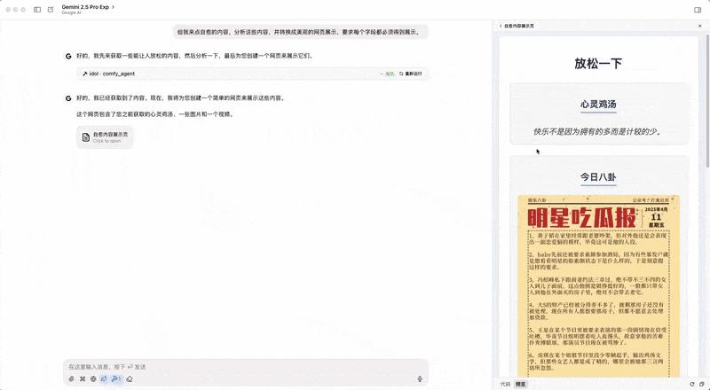

# “爽”MCP

一个基于开源API构造的“爽”MCP，包含当日明显八卦、心灵鸡汤和一个小姐姐视频。   
   
**轻松一下，年轻十岁！**

## 使用

1. git clone https://github.com/huangxinping/comfy-mcp.git
2. 客户端（如ChatWise或CherryStudio）中配置MCP服务器：
    uv run --with mcp[cli] mcp run {YOUR_PATH}/comfy-mcp/server.py
3. 提示词：给我来点自愈的内容，分析这些内容，并转换成美观的网页展示，要求每个字段都必须得到展示。 

## 示例
